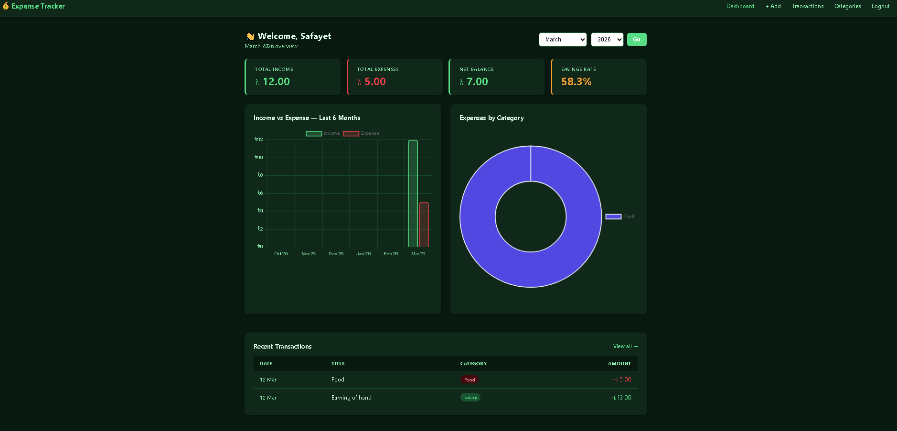
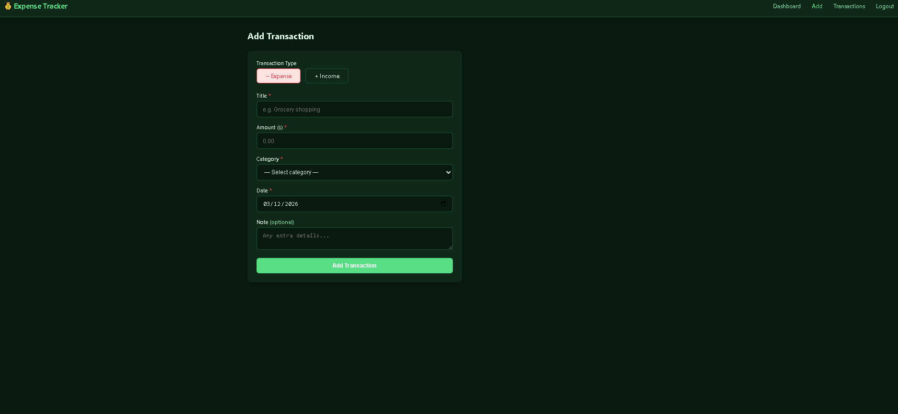
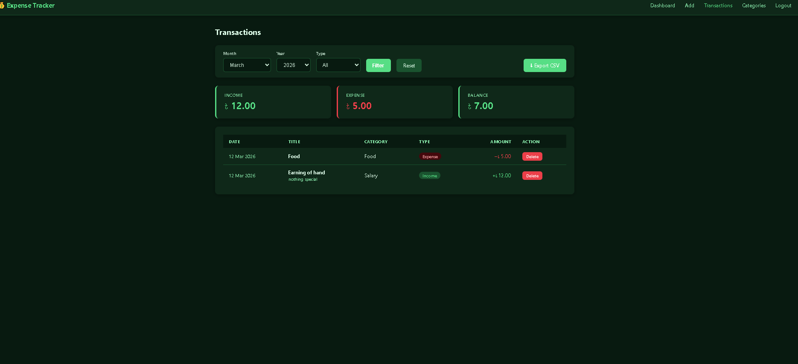
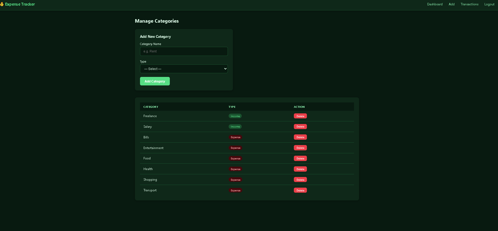
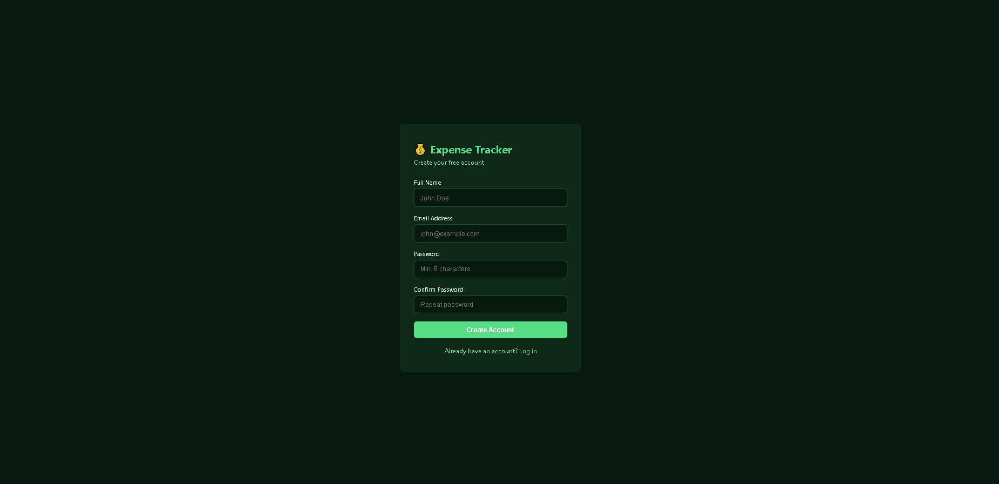

About the project: 
This app lets people sign up and log in and also saves passwords with PHP's built-in hashing. Users can add transactions for income and expenses with titles, amounts, dates, and notes once they are logged in. Every user can make their own categories to help them keep track of their money. The dashboard shows a monthly summary with total income, total expenses, net balance, and savings rate. It also has two charts: a bar chart that shows income vs. expenses over the last six months and a doughnut chart that shows how much was spent in each category. Users can filter their entire transaction history by month, year, and type. They can also export any filtered view as a CSV file that can be opened in Excel or Google Sheets. The app works on both desktop and mobile devices.
## Tech Stack
Backend: Php
Database: Mysql with PDO
Frontend: Html, CSS, Chart.js
Development Environment: XAMPP

For Setup:
1.Clone repo:
git clone https://github.com/safayetsawom/expense-tracker.git
2. Start Apache and MySQL in XAMPP
3. Open ‘http://localhost/phpmyadmin’
4. Create a database called ‘expense_tracker’ then copy-paste db code from ‘sql/expense_tracker.sql’
6. Open ‘http://localhost/expense-tracker’ [this is the url for your website]

## Security Practices Used

- Passwords hashed with `password_hash()` / `password_verify()`
- All DB queries use **PDO prepared statements** (SQL injection safe)
- Session-based authentication with login guards
- All user output escaped with `htmlspecialchars()`
## Screenshots

### Dashboard

### Add Transaction

### Transactions

### Categories

### Login

### Register

## License
MIT
